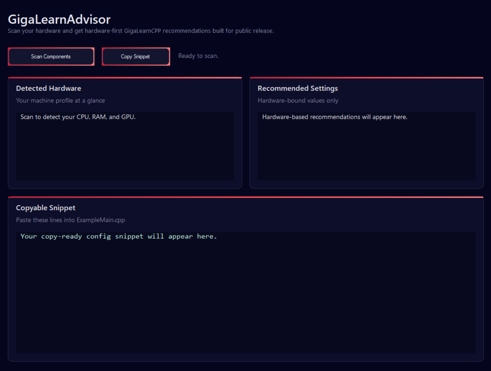

# GigaLearnAdvisor

GigaLearnAdvisor is a standalone Windows utility for generating hardware-based starting settings for GigaLearnCPP.
It scans your machine and recommends:
- `cfg.deviceType`
- `cfg.numGames`
- `cfg.ppo.sharedHead.layerSizes`
- `cfg.ppo.policy.layerSizes`
- `cfg.ppo.critic.layerSizes`

What it looks at:
- CPU model
- physical and logical core counts
- installed system RAM
- detected GPU
- dedicated VRAM

What it does not try to tune:
- `gaeGamma`
- `tsPerItr`
- `miniBatchSize`
- reward weights
- learning rates beyond a general starting point

Why:
Those values are much more dependent on training stage, reward design, PPO behavior, and personal preference than raw hardware alone.

Use case:
GigaLearnAdvisor is meant to give you a strong first-pass config quickly, especially when setting up a new machine or sharing GigaLearnCPP with other users.

Important note:
This is a starting-point advisor, not a full autotuner. You should still benchmark SPS locally and adjust `numGames` if you want the strongest final setup.
